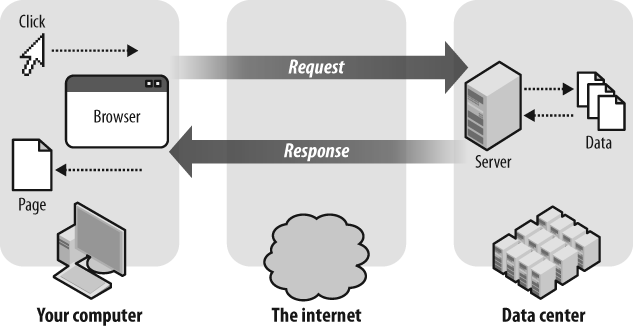
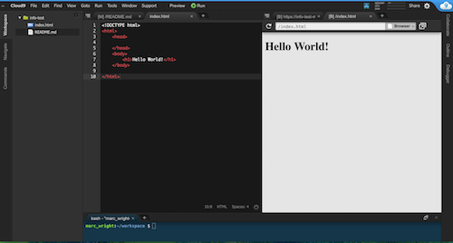

  
# WDIR Info Session Code Along

## Agenda + Objectives
* [Describe the Request Response Cycle](#request-response)
* [Understand the differences between HTML, CSS and Javascript](#html-css-js)
* [Build a webpage using HTML, CSS and Javascript](#build)
* [Bonus](#bonus)
* [Conclusion](#conclusion)

<br>

## <a name="request-response">The request/response cycle</a>

The **request/response cycle** is how your browser retrieves files from a server and renders a webpage.

<br>


<br>

When you visit [ESPN](www.espn.com) you're making a **request** to a server that's located somewhere on the internet. Espn.com is merely an alias for the server's actual IP (Internet Protocol) address which is `http://68.71.212.186/`. I would never remember that!

The server then sends you a **response** that generally consists of **HTML, CSS and Javascript** files. _We also receive other files like images, video, ads_. 

Your browser takes those ingredients (the files) and bakes (renders) a webpage for you to view and interact with.

<br>

 


- Copy and paste `68.71.212.186` into your browser URL. Where does it take you?
- Let's open the **Chrome Developer Tools** (option + command + i) and select the **Network** tab. Notice all of the files that are being sent back to us in the response from ESPN!
- Let's check out come **request** and **response** headers. 

<br>

 

<br>

 

1. Describe the request/response cycle in your own words.
2. What are the three file types that compose a basic webpage (hint... we're about to build a site with these three types)?

<br>

## <a name="html-css-js">Our webpage ingredients: HTML + CSS + Javascript</a>

Most webpages (at a minimum) consist of HTML, CSS and Javascript files.

- **HTML** stands for Hyper Text Markup Language. We use HTML tags to create HTML elements which give our page structure. You can think of HTML as the **NOUNS** of our page.
- **CSS** stands for Cascading Style Sheets. You can think of CSS as the **ADJECTIVES** of our page. CSS consists of **rules** that determine the color, fonts, and sizes of our HTML elements.
- **Javascript** dictates the behavior of our webpage. It allows events to happen when we click on a button to submit a form. Javascript also helps Google "guess" what we're searching for in the search box.

<br>


<br>

Our browser **bakes** these **ingredients** (files) together to render a webpage.

<br>

 

## <a name="build">Build a webpage using HTML, CSS and Javascript</a>

In Cloud9 we're gonna build a webpage that contains HTML, CSS and Javascript so we can see what each does for us. We'll walk through each of these step together.

1. Go to Cloud9 and create a new workspace. Give it a name and select "blank" workspace.

2. Let's create a new file named `index.html`. You can do this by right-clicking on the folder on the top left of your screen and naming the file `index.html`.

3. In your `index.html`, type in `html` then hit Tab. It should auto create a basic HTML structure. Next, inside the `<html>` tags, add `<head>` and `<body>`. Finally, inside the `body` of our page, let's add an `h1` tag that says "Hello World!". Our HTML markup should look like so:

	```html
	<!DOCTYPE html>
	<html>
	  <head>
	        
	  </head>
	  <body>
	    <h1>Hello World!</h1>
	  </body>	    
	</html>
	```
	
	Great, now we've got a great basic starter structure using HTML tags! Let's see it in action. Click on `Preview` at the top of the Cloud9 interface to open a new browser window like so:
		
	


4. Let's change the color and font of our "Hello World!" by adding some CSS. Normally, we'd want to put our CSS rules in a separate file, but today we're gonna add them inside our `head` tags:

	```html
	<!DOCTYPE html>
	<html>
	  <head>
	    <style type="text/css">
		   h1 {
			  font-family: Georgia;
			  color: green
			}
		 </style>
	  </head>
	  <body>
		 <h1>Hello World!</h1>
     </body>
   </html>
	```	
	
	The browser window in Cloud9 should automatically refresh and show your changes like so:

	
	
	Finally, let's add a button that will use Javascript to alert your name. Again, normally we'd want to create a separate file for this, but today we're gonna put it within `<script>` tags in our HTML.
	

5. Let's add a `button` element to our page and a Javascript [onclick](http://www.w3schools.com/jsref/event_onclick.asp) event. When our button is clicked, it'll fire off a browser alert. Let's add the code below:

	```html
	<button onclick="alert('Hello World!')">Click me!</button> 
	// add the button inside the body of your page, just below your h1
	```

	The alert should look like this when clicked:
	
	
	
	<br>

## <a name="bonus"></a>

If you're feeling super confident, here are a few bonus suggestions...

1. Add an [external image to your page](http://www.w3schools.com/tags/tag_img.asp)
2. Try adding a [todo list](http://www.w3schools.com/html/html_lists.asp)
3. Try to move your CSS rules to an [external stylesheet](http://www.w3schools.com/css/css_howto.asp)

<br>
## <a name="conclusion"></a>

Great work! Keep going! Here are some additional resources.

- [W3 Schools HTML Tutorial](http://www.w3schools.com/html/default.asp)
- [W3 Schools CSS Tutorial](http://www.w3schools.com/css/default.asp)
- [W3 Schools Javascript Tutorial](http://www.w3schools.com/js/default.asp)
- [Request Response Cycle](http://celineotter.azurewebsites.net/world-wide-web-http-request-response-cycle/)	
	


